# Java Delivery Lab — Jenkins, Docker, Kubernetes

A local DevOps portfolio project that delivers a Java web application from source code to two running Kubernetes replicas. The lab runs without AWS or paid cloud resources.

Inspired by [DevCloudNinjas project #5](https://github.com/DevCloudNinjas/DevOps-Projects/tree/master/project-05-docker-jenkins-k8s). This repository contains an original Jakarta Servlet application, CI/CD scripts, Jenkins configuration, and a local deployment on Kind.

## Project objectives

1. Set up Jenkins, Java, Maven, and Docker.
2. Retrieve a Java application from Git and build a WAR with Maven.
3. Package the application in a Tomcat container image.
4. Automate the build and deployment with Jenkins.
5. Verify application availability. The original project also includes Kubernetes manifests.

The original tutorial hosts Jenkins and Docker on AWS EC2. This implementation uses a Jenkins container and a local Kind cluster; no AWS deployment was performed.

## Architecture

```mermaid
flowchart LR
    source[GitHub or local source code] --> jenkins[Jenkins: delivery-lab]
    jenkins --> maven[Maven: compile + 4 JUnit tests]
    maven --> war[ROOT.war]
    war --> docker[Docker: non-root Tomcat]
    docker --> load[Kind: local image import]
    load --> deployment[Kubernetes: Deployment / 2 replicas]
    deployment --> service[ClusterIP Service]
    service --> smoke[6 functional HTTP checks]
    smoke --> evidence[Jenkins logs and artifacts]
```



Jenkins uses a built-in Freestyle job. The delivery stages are defined in `scripts/ci.sh`, and the job configuration lives in `jenkins/init.groovy.d/setup.groovy`. Pipeline, Git, and JUnit plugins are not required. JUnit XML files are archived as artifacts; a dedicated JUnit results chart is not available in the UI.

## Engineering decisions

- Java 17, Jakarta Servlet 6, and Tomcat 10 form a compatible application stack.
- Base Docker images are pinned by tag and digest; Kind and kubectl binaries are verified with SHA-256.
- A failing test, Docker build, rollout, or smoke test stops the delivery.
- Images use `<revision>-<build-number>` tags. A source hash is used for local snapshots without Git commits.
- The WAR is expanded during the build. The Dockerfile adds a single application layer, and startup does not need to write into the webapps directory.
- Two replicas are deployed using rolling updates with `maxUnavailable: 0`.
- Startup, readiness, and liveness probes check application HTTP endpoints.
- The application runs as UID 10001 with a read-only root filesystem, no Linux capabilities, and no mounted service account token.
- The namespace enforces the `restricted` Pod Security standard, with explicit CPU and memory requests and limits.
- Jenkins requires authentication and listens only on loopback. Its password is generated locally and stored in the ignored `.env` file.
- Kubernetes credentials, the Maven cache, and local settings are excluded from Git.

## Quick start

Requirements: Linux x86_64 or Ubuntu on WSL2, Docker Engine with Compose v2, `curl`, Python 3, and access to `/var/run/docker.sock`. Recommended resources: 8 GB RAM and 20 GB of free disk space; allow 35 GB when Docker uses the `vfs` storage driver. Ports 8080, 8081, and 18080 must be available.

```bash
# Run from the repository root
bash scripts/bootstrap.sh
python3 scripts/run-job.py
```

Bootstrap downloads and verifies Kind 0.27.0 and kubectl 1.32.2, creates or starts the `portfolio` cluster, prepares the Jenkins image, and checks that the authenticated job is available. The Jenkins image is rebuilt only when its build inputs change or the retained image does not match. Java and Maven are supplied inside Docker images; they do not need to be installed on the host. Repeated startup preserves the password and Jenkins history.

Access Jenkins locally at `127.0.0.1:8080`. The username is `hundrik`; find the password in your local `.env` file. Never commit that file. `run-job.py` triggers a build through the API, waits for its result, and saves the console log in `evidence/`.

View the application after a successful build:

```bash
bash scripts/view-app.sh
```

Open `127.0.0.1:8081` in your browser. Port forwarding runs until you press Ctrl+C. To check the application:

```bash
bash scripts/smoke.sh http://127.0.0.1:8081
```

## GitHub integration and automatic builds

By default, Jenkins builds a local source snapshot mounted read-only. The job runs on the `H/5 * * * *` schedule, approximately every five minutes, and can also be triggered manually.

To build from your public GitHub repository:

1. Open Jenkins → `delivery-lab` → Configure.
2. Set the default `SOURCE_REPOSITORY` parameter to your repository URL, such as `https://github.com/hundrik3/devops.git`.
3. Set `SOURCE_BRANCH` to `main` or your actual branch name.
4. Save the configuration and select Build with Parameters.

The job retrieves the branch with `git fetch`, builds the current commit, and deploys it. Scheduled runs skip the build when the source is unchanged and the current Deployment is healthy, retaining the previous artifacts. `FORCE_REBUILD` repeats the full workflow; `run-job.py` enables this parameter. No webhook is used. For a private repository on your own machine, configure secure Git authentication separately; tokens embedded in repository URLs are not supported.

## Validation and evidence

See the [validation report](docs/validation.md), [Jenkins console log](evidence/jenkins-console.txt), and [build metadata](evidence/jenkins-build.json). These files record actual local runs. Presentation guidance is available in [docs/portfolio.md](docs/portfolio.md).

Application endpoints:

| Request | Expected result |
|---|---|
| `GET /` | Java Delivery Lab HTML page |
| `GET /healthz` | `200`, `ok` |
| `GET /readyz` | `200`, `ok` |
| `GET /api/hello` | `200`, `Hello, DevOps!` |
| `GET /api/hello?name=Hundrik` | `200`, `Hello, Hundrik!` |
| A name longer than 80 characters | `400` |

## Operations

```bash
export KUBECONFIG="$PWD/.local/kubeconfig"
.local/bin/kubectl -n delivery-lab get pods
.local/bin/kubectl -n delivery-lab logs deployment/delivery-lab
.local/bin/kubectl -n delivery-lab rollout history deployment/delivery-lab
# After at least two deliveries, restore the previous revision:
.local/bin/kubectl -n delivery-lab rollout undo deployment/delivery-lab
.local/bin/kubectl -n delivery-lab rollout status deployment/delivery-lab --timeout=180s
```

Cleanup:

```bash
bash scripts/cleanup.sh
# To also delete Jenkins history and its user account:
docker compose down --volumes
```

Cleanup removes this Compose project's Jenkins container and the `portfolio` Kind cluster. Local tools, images, and `.env` are retained. The `kind` network is preserved because other Kind clusters may use it.

## Scope and limitations

This is a local learning lab. Jenkins has access to the Docker socket and local Kubernetes credentials, so only run trusted code. This access allows control of the Docker host; a production deployment would require separate agents and restricted Kubernetes permissions. Do not use this lab on a machine with an unrelated Kind cluster named `portfolio`.

Registry publishing, AWS deployment, webhooks, TLS ingress, monitoring, and vulnerability scanning are outside this implementation. Update the base images and run a security scan before using the project outside the lab. Availability during rolling updates was not measured with a continuous load test; `maxUnavailable: 0` defines the update policy.

The nested container environment uses the `native` snapshotter and containerd local image import. If `/dev/kmsg` is missing, bootstrap creates the device inside its own Kind node. When an HTTPS proxy is configured, Maven uses local settings and trusted host certificates; TLS verification remains enabled.
