# Java Delivery Lab — Jenkins, Docker, Kubernetes

Локальный DevOps-проект для портфолио: доставка Java web-приложения от исходного кода до двух работающих реплик в Kubernetes. Стенд запускается без AWS и платных облачных ресурсов.

Основа задания: [проект №5 DevCloudNinjas](https://github.com/DevCloudNinjas/DevOps-Projects/tree/master/project-05-docker-jenkins-k8s). Реализация здесь самостоятельная: собственное приложение на Jakarta Servlet, CI/CD-скрипты, конфигурация Jenkins и локальное развёртывание в Kind.

## Что требовалось в задании

1. Подготовить Jenkins, Java, Maven и Docker.
2. Получить Java-приложение из Git и собрать WAR через Maven.
3. Упаковать WAR в образ Tomcat.
4. Автоматизировать сборку и развёртывание средствами Jenkins.
5. Проверить доступность приложения. Каталог исходного проекта дополнительно содержит манифесты Kubernetes.

В оригинальном руководстве Jenkins и Docker размещены на AWS EC2. В этой реализации используются контейнер Jenkins и локальный кластер Kind; AWS-развёртывание не выполнялось.

## Архитектура

```mermaid
flowchart LR
    source[GitHub или локальный исходный код] --> jenkins[Jenkins: delivery-lab]
    jenkins --> maven[Maven: compile + 4 JUnit tests]
    maven --> war[ROOT.war]
    war --> docker[Docker: Tomcat / non-root]
    docker --> load[Kind: загрузка образа]
    load --> deployment[Kubernetes: Deployment / 2 реплики]
    deployment --> service[ClusterIP Service]
    service --> smoke[6 функциональных HTTP-проверок]
    smoke --> evidence[Артефакты и журнал Jenkins]
```



Jenkins использует встроенное Freestyle-задание. Этапы описаны в `scripts/ci.sh`, настройка задания — в `jenkins/init.groovy.d/setup.groovy`. Pipeline, Git и JUnit-плагины для запуска не нужны. JUnit XML сохраняется как артефакт; специального графика результатов JUnit в UI нет.

## Инженерные решения

- Java 17, Jakarta Servlet 6 и Tomcat 10 совместимы между собой.
- Базовые Docker-образы зафиксированы тегом и digest; Kind и kubectl проверяются по SHA-256.
- Сборка останавливается при ошибке теста, Docker build, rollout или smoke test.
- Образ имеет тег `<revision>-<build-number>`, без `latest`. Для локального снимка без Git-коммитов используется хеш исходников.
- WAR распаковывается при сборке; Dockerfile добавляет только один слой приложения и не требует записи в webapps при старте.
- Две реплики и rolling update с `maxUnavailable: 0`.
- Startup/readiness/liveness probes проверяют HTTP endpoints приложения.
- Контейнер приложения работает с UID 10001, read-only root filesystem, без Linux capabilities и без service account token.
- Namespace применяет Pod Security `restricted`; указаны requests и limits CPU/RAM.
- Jenkins требует входа; слушает только loopback. Пароль генерируется локально и хранится в игнорируемом `.env`.
- Kubernetes config, Maven cache и локальные настройки не входят в Git.

## Быстрый запуск

Нужен Linux x86_64 или Ubuntu в WSL2, Docker Engine с Compose v2, `curl`, Python 3 и доступ пользователя к `/var/run/docker.sock`. Рекомендуется 8 GB RAM и 20 GB свободного диска (для Docker с драйвером `vfs` рекомендуется запас 35 GB). Порты 8080, 8081 и 18080 должны быть свободны.

```bash
# Из корня этого репозитория
bash scripts/bootstrap.sh
python3 scripts/run-job.py
```

Bootstrap проверяет и скачивает Kind 0.27.0 и kubectl 1.32.2, создаёт кластер `portfolio`, собирает образ Jenkins и проверяет наличие задания с авторизацией. Java и Maven внутри Jenkins поставляются Docker-образами; устанавливать их на хост не требуется. Повторный запуск сохраняет пароль и историю Jenkins.

Jenkins открывается локально по адресу `127.0.0.1:8080`. Пользователь — `hundrik`; пароль можно посмотреть в своём локальном `.env`. Не добавляйте этот файл в Git. `run-job.py` запускает сборку через API, ожидает результат и сохраняет журнал в `evidence/`.

Посмотреть приложение после успешной сборки:

```bash
bash scripts/view-app.sh
```

В своём браузере откройте `127.0.0.1:8081`. Команда port-forward работает до Ctrl+C. Для внутренней проверки:

```bash
bash scripts/smoke.sh http://127.0.0.1:8081
```

## GitHub и автоматическая сборка

До публикации Jenkins работает с локальным снимком файлов, смонтированным read-only. Задание запускается по расписанию `H/5 * * * *` — примерно каждые пять минут — и вручную.

После загрузки в свой публичный GitHub-репозиторий:

1. Откройте Jenkins → `delivery-lab` → Configure.
2. В параметрах задания задайте значение по умолчанию `SOURCE_REPOSITORY`: URL вашего репозитория, например `https://github.com/hundrik3/devops.git`.
3. Укажите `SOURCE_BRANCH`: `main` или вашу фактическую ветку.
4. Сохраните и запустите Build with Parameters.

Задание получит ветку через `git fetch`, соберёт текущий коммит и выполнит доставку. При неизменных исходниках и здоровом текущем Deployment расписание пропускает сборку и сохраняет предыдущие артефакты. `FORCE_REBUILD` запускает весь цикл повторно; `run-job.py` включает этот параметр. Webhook здесь не используется. Для приватного GitHub на своей машине нужно отдельно настроить безопасную Git-аутентификацию; токен в URL не поддерживается.

## Проверки и доказательства

Смотрите [результаты проверки](docs/validation.md), [журнал Jenkins](evidence/jenkins-console.txt) и [метаданные сборки](evidence/jenkins-build.json). В этих файлах записаны реальные результаты локального запуска. Инструкции для портфолио и демонстрации — в [docs/portfolio.md](docs/portfolio.md).

API:

| Запрос | Ожидаемый результат |
|---|---|
| `GET /` | HTML-страница Java Delivery Lab |
| `GET /healthz` | `200`, `ok` |
| `GET /readyz` | `200`, `ok` |
| `GET /api/hello` | `200`, `Hello, DevOps!` |
| `GET /api/hello?name=Hundrik` | `200`, `Hello, Hundrik!` |
| Имя длиннее 80 символов | `400` |

## Эксплуатация

```bash
export KUBECONFIG="$PWD/.local/kubeconfig"
.local/bin/kubectl -n delivery-lab get pods
.local/bin/kubectl -n delivery-lab logs deployment/delivery-lab
.local/bin/kubectl -n delivery-lab rollout history deployment/delivery-lab
# После как минимум двух доставок можно вернуть предыдущую ревизию:
.local/bin/kubectl -n delivery-lab rollout undo deployment/delivery-lab
.local/bin/kubectl -n delivery-lab rollout status deployment/delivery-lab --timeout=180s
```

Очистка:

```bash
bash scripts/cleanup.sh
# Если нужно также удалить историю и учётную запись Jenkins:
docker compose down --volumes
```

Очистка удаляет только контейнер Jenkins этого Compose-проекта и Kind-кластер `portfolio`. Локальные инструменты, образы и `.env` сохраняются. Сеть `kind` сохраняется, поскольку её могут использовать другие Kind-кластеры.

## Границы стенда

Это учебный локальный стенд. Jenkins получает доступ к Docker socket и конфигурации локального кластера — запускайте только доверенный код. Такой доступ позволяет управлять Docker-хостом; для production потребуются отдельные агенты и ограниченные Kubernetes-права. На машине не должно быть чужого Kind-кластера с именем `portfolio`.

Registry push, AWS, webhook, TLS ingress, мониторинг и сканирование уязвимостей здесь не реализованы. Перед использованием вне лаборатории обновите базовые образы и выполните security scan. Доступность во время rolling update не измеряется непрерывным нагрузочным тестом; `maxUnavailable: 0` задаёт политику обновления.

В контейнерной среде используется `native` snapshotter, загрузка образа выполняется локальным импортом containerd, а при отсутствии `/dev/kmsg` bootstrap создаёт устройство только внутри своей Kind-ноды. При сетевом прокси Maven использует локальный settings.xml и доверенные сертификаты хоста; TLS verification остаётся включённой.
